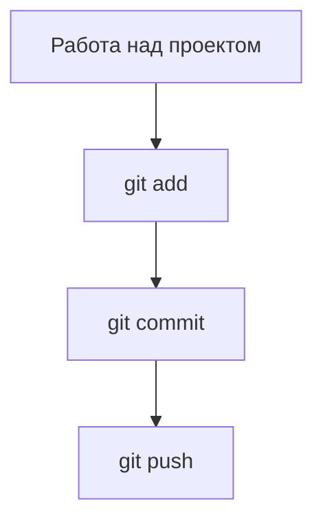
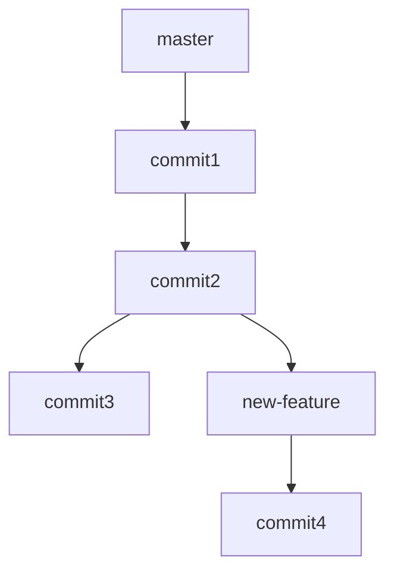
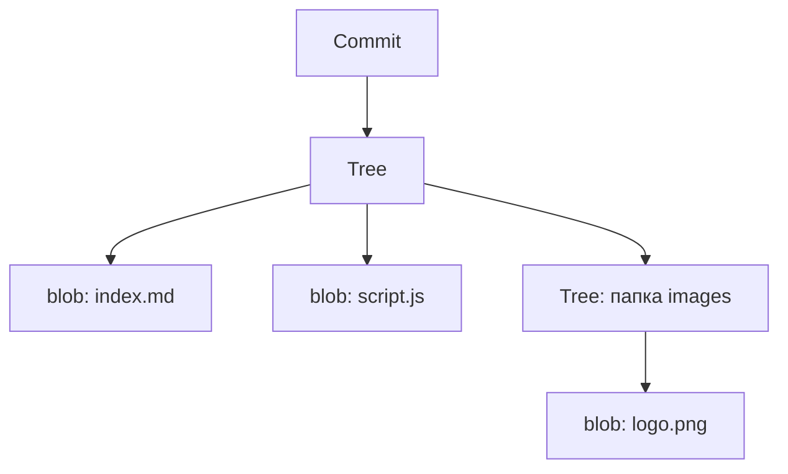

## 📘 Git

---

### 🔍 Что такое Git?

Git — это система контроля версий. Она помогает сохранять и отслеживать изменения в коде, работать над проектом в команде, а также возвращаться к любому состоянию проекта из прошлого.

#### Зачем нужен Git?

| Проблема                                | Git помогает                     |
| --------------------------------------- | -------------------------------- |
| Потеряли важный файл                    | Восстановить из истории          |
| Нужно отменить неудачные изменения      | Вернуться к предыдущей версии    |
| Несколько человек работают над проектом | Сливать изменения без конфликтов |
| Нужно быстро починить код на продакшене | Вернуться в стабильную ветку     |

---

### 🗂️ Основные термины

| Термин      | Объяснение                                             |
| ----------- | ------------------------------------------------------ |
| Репозиторий | Папка с вашим проектом, которую отслеживает Git        |
| Коммит      | Снимок состояния файлов в определённый момент времени  |
| Ветка       | Отдельная линия разработки                             |
| Индекс      | Область подготовки файлов к коммиту (staging area)     |
| `.git`      | Скрытая папка, где Git хранит всю информацию о проекте |

---

### 🛠️ Установка Git

Установите Git с официального сайта: [git-scm.com](https://git-scm.com)

---

### 🔁 Базовый рабочий цикл



1. Изменяете файлы
2. Добавляете их в индекс командой `git add`
3. Сохраняете коммит: `git commit -m "Комментарий"`
4. Отправляете изменения на сервер: `git push`

#### 🧪 Пример

```bash
git init
git add .
git commit -m "Первый коммит"
git remote add origin https://github.com/yourname/project.git
git push -u origin master
```

---

### 🚀 Как работает `git push`

Когда вы завершили работу над изменениями, закоммитили их и готовы отправить на сервер (например, GitHub), вы используете:

```bash
git push
```

Однако при первой отправке новой ветки нужно указать направление:

```bash
git push --set-upstream origin my-branch
```

или коротко:

```bash
git push -u origin my-branch
```

#### 🔍 Разберём по частям:

* `git push` — команда отправки коммитов из локальной ветки в удалённый репозиторий
* `origin` — имя удалённого репозитория (по умолчанию так называют GitHub/Bitbucket/GitLab)
* `my-branch` — имя локальной ветки
* `--set-upstream` (или `-u`) — устанавливает связь между локальной и удалённой веткой, чтобы в будущем можно было писать просто `git push` / `git pull`

#### 📌 Примеры:

```bash
git push -u origin main
# или
git push -u origin feature/auth
```

Без `-u`, придётся указывать имя ветки каждый раз:

```bash
git push origin main
```

После установки upstream можно просто писать:

```bash
git push
git pull
```

---

### 🌿 Ветвление и работа в команде



#### Основные команды ветвления:

```bash
git branch                  # показать список веток
git branch new-feature      # создать новую ветку
git checkout new-feature    # перейти в ветку (устаревший способ)
git switch new-feature      # перейти в ветку (новый способ)
git merge new-feature       # слить ветку с текущей
```

---

### 💥 Слияния и конфликты

Конфликт возникает, если два изменения затрагивают одну и ту же строку кода:

```plaintext
<<<<<<< HEAD
Твой код
=======
Чужой код
>>>>>>> ветка
```

#### 💡 Чтобы решить конфликт:

* Выберите нужную строку
* Удалите метки `<<<<<<<`, `=======`, `>>>>>>>`
* Сохраните файл и выполните:

```bash
git add файл
# если был merge:
git commit
# если rebase:
git rebase --continue
```

---

### 🕰 История и откаты

```bash
git log                      # история коммитов
git log --oneline            # короткая история

git diff                     # показать различия

git checkout <commit-id>     # перейти к конкретному коммиту

# Восстановление файлов:
git restore file.txt         # откатить файл до последнего коммита

git reset HEAD~1             # удалить последний коммит (оставив изменения)
git reset --hard <commit-id> # откат проекта к указанному коммиту (ОСТОРОЖНО!)

git revert <commit-id>       # создать обратный коммит (без удаления истории)
```

---

### 📋 Полный список основных команд

```bash
git init                         # создать репозиторий
git status                       # показать текущий статус
git add .                        # добавить все файлы
git commit -m "сообщение"        # зафиксировать изменения
git log --oneline                # краткий журнал
git diff                         # показать изменения
git branch                       # список веток
git checkout -b новая_ветка      # создать и перейти в ветку
git merge ветка                  # слить ветку
git pull                         # получить изменения с сервера
git push                         # отправить изменения на сервер
```

---

### 🔁 Сравнение GitHub, GitLab и Bitbucket

| Характеристика    | GitHub         | GitLab        | Bitbucket               |
| ----------------- | -------------- | ------------- | ----------------------- |
| Владелец          | Microsoft      | GitLab Inc.   | Atlassian               |
| CI/CD             | GitHub Actions | Встроенный CI | Bitbucket Pipelines     |
| Публичные проекты | Да             | Да            | Да                      |
| Приватные проекты | Да (∞)         | Да (∞)        | Да (до 5 пользователей) |
| Wiki и Issues     | Да             | Да            | Да                      |
| Поддержка SSH     | Да             | Да            | Да                      |

---

### 💻 Визуализация истории в редакторах

**VS Code:**

* Установите расширение Git Graph или GitLens
* Откройте `View → Git Graph` или вкладку Source Control

**IntelliJ IDEA:**

* Перейдите `VCS → Git → Show Git Log`
* Используйте панель коммитов

---

### 📈 Структура объектов в Git

Git — это не просто копирование файлов. Это граф объектов, где каждый коммит указывает на "снимок" дерева файлов.

#### 🔹 Типы объектов:

| Объект | Что содержит                 |
| ------ | ---------------------------- |
| blob   | Содержимое файла (без имени) |
| tree   | Папка: список файлов/папок   |
| commit | Ссылка на дерево + метаинфо  |



Если файл не менялся — Git повторно использует blob. Изменился один файл — хранится только он, а не весь проект заново. Всё это в `.git/objects`.

---

### 📌 Полезные ссылки

* [Официальная документация Git (на русском)](https://git-scm.com/book/ru/v2)
* [Интерактивное обучение Git](https://learngitbranching.js.org/)
* [Git Handbook от GitHub](https://docs.github.com/en/get-started/using-git/about-git)
* [Визуализация коммитов](https://git-school.github.io/visualizing-git/)

---

### ✅ Заключение

Git — это как машина времени для вашего кода. Он позволяет:

* Не бояться ошибок
* Работать вместе с другими
* Экспериментировать безопасно
