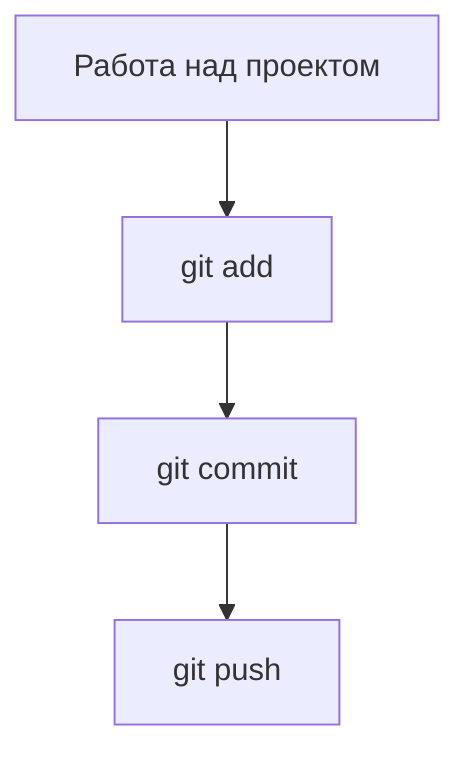
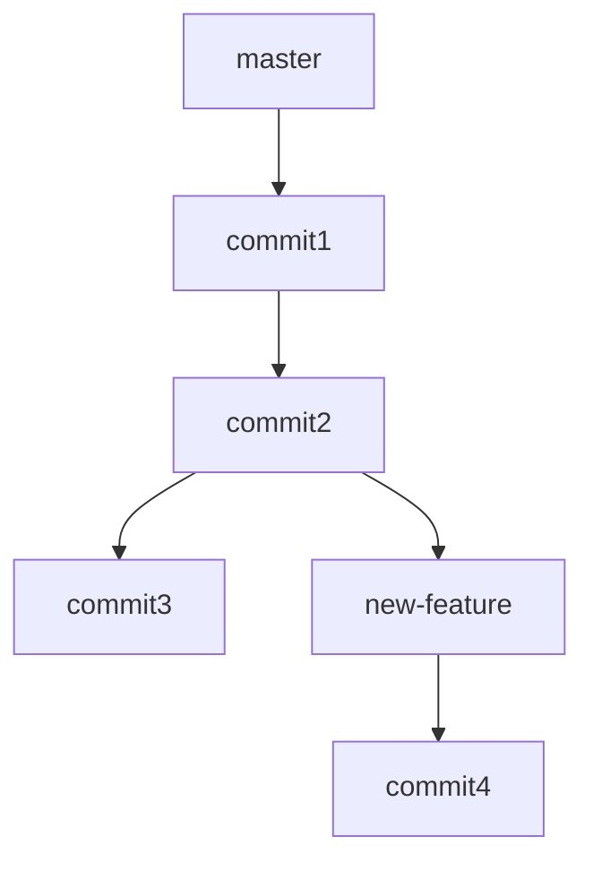

# 📘 Учебное пособие по Git для начинающих

## 🔍 Что такое Git?

**Git** — это система контроля версий. Она помогает сохранять и отслеживать изменения в коде, работать над проектом в команде, а также возвращаться к любому состоянию проекта из прошлого.

### Зачем нужен Git?

| Проблема                                        | Git помогает                         |
|------------------------------------------------|--------------------------------------|
| Потеряли важный файл                           | Восстановить из истории              |
| Нужно отменить неудачные изменения             | Вернуться к предыдущей версии        |
| Несколько человек работают над одним проектом  | Сливать изменения без конфликтов     |
| Нужно быстро починить код на продакшене        | Вернуться в стабильную ветку         |

---

## 🗂️ Основные термины

| Термин      | Объяснение                                                                 |
|-------------|------------------------------------------------------------------------------|
| Репозиторий | Папка с вашим проектом, которую отслеживает Git                            |
| Коммит      | Снимок состояния файлов в определённый момент времени                      |
| Ветка       | Отдельная линия разработки                                                  |
| Индекс (staging) | Область подготовки файлов к коммиту                                 |
| .git        | Скрытая папка, в которой Git хранит всю информацию о вашем проекте         |

---

## 🛠️ Установка Git

Установите Git с официального сайта: [git-scm.com](https://git-scm.com)

---

## 🔁 Базовый рабочий цикл



1. **Изменяете файлы**
2. **Добавляете их в индекс** командой `git add`
3. **Сохраняете коммит** командой `git commit -m "Комментарий"`
4. **Отправляете на GitHub или GitLab** — `git push`

---

## 🧪 Пример

```bash
git init
git add .
git commit -m "Первый коммит"
git remote add origin https://github.com/yourname/project.git
git push -u origin master
```

---

## 🌿 Ветвление и работа в команде



### Основные команды ветвления

```bash
git branch
git branch new-feature
git checkout new-feature
git switch new-feature
git merge new-feature
```

---

## 💥 Слияния и конфликты

**Конфликт** возникает, если два изменения затрагивают одну и ту же строку кода.

```plaintext
<<<<<<< HEAD
Твой код
=======
Чужой код
>>>>>>> ветка
```

Реши вручную, убери метки и закоммить.

---

## 🕰 История и откаты

```bash
git log
git diff
git checkout <commit-id>
git restore file.txt
git reset HEAD~1
git revert <commit-id>
git reset --hard <commit-id>   # Осторожно!
```

---

## 📋 Полный список основных команд

```bash
git init                         # создать репозиторий
git status                       # показать текущий статус
git add .                        # добавить все файлы
git commit -m "сообщение"        # зафиксировать изменения
git log --oneline                # краткий журнал
git diff                         # показать изменения
git branch                       # список веток
git checkout -b новая_ветка      # создать и перейти
git merge ветка                  # слить ветку
git pull                         # получить изменения с сервера
git push                         # отправить изменения на сервер
```

---

## 🔁 Сравнение GitHub, GitLab и Bitbucket

| Характеристика     | GitHub                       | GitLab                          | Bitbucket                     |
|--------------------|------------------------------|----------------------------------|-------------------------------|
| Владелец           | Microsoft                    | GitLab Inc.                     | Atlassian                     |
| CI/CD              | GitHub Actions               | Встроенный GitLab CI            | Bitbucket Pipelines           |
| Публичные проекты  | Да                           | Да                               | Да                            |
| Приватные проекты  | Да (неограничено)            | Да (неограничено)               | Да (до 5 пользователей)       |
| Wiki и Issues      | Да                           | Да                               | Да                            |
| Поддержка SSH      | Да                           | Да                               | Да                            |

---

## 💻 Визуализация истории в редакторах

### VS Code

1. Установите расширение **Git Graph** или **GitLens**
2. Перейдите в `View → Git Graph` или откройте вкладку Source Control
3. Вы увидите граф веток, список коммитов и подробности изменений

### IntelliJ IDEA

1. Откройте проект с включённым Git
2. Перейдите в `VCS → Git → Show Git Log`
3. Используйте панель коммитов для навигации и управления ветками

---

## 📈 Структура объектов в Git

.svg?cdnVersion=1202)

---

## 📌 Полезные ссылки

- [Официальная документация Git (на русском)](https://git-scm.com/book/ru/v2)
- [Интерактивное обучение Git](https://learngitbranching.js.org/)
- [Git Handbook от GitHub](https://guides.github.com/introduction/git-handbook/)
- [Визуализация коммитов](https://git-school.github.io/visualizing-git/)

---

## ✅ Заключение

Git — это как машина времени для вашего кода. Он позволяет:
- Не бояться ошибок
- Работать вместе с другими
- Экспериментировать безопасно

---

_Создано как обучающее пособие для новичков. Подходит для размещения на GitHub или использования как README._
