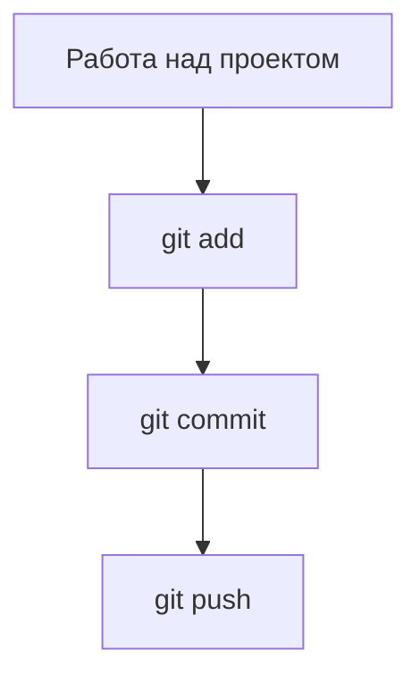
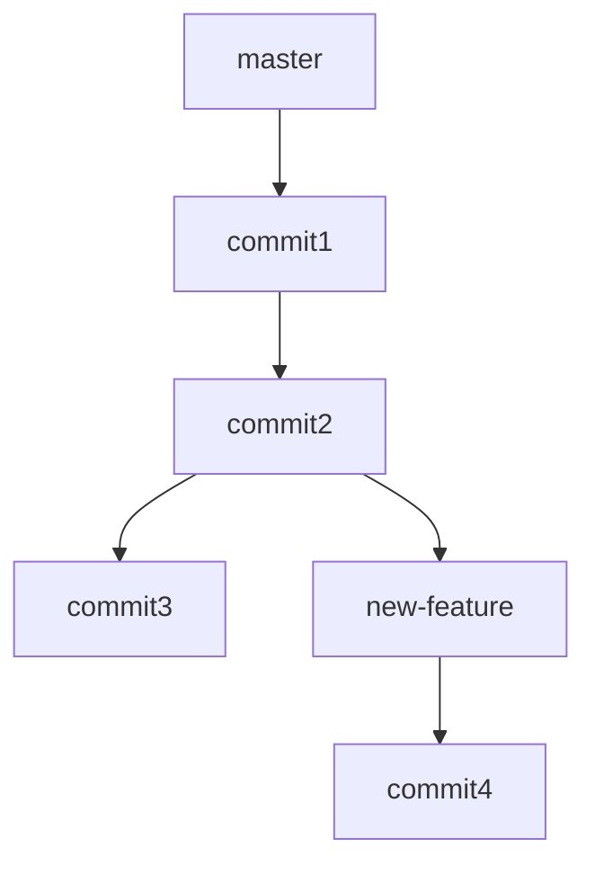
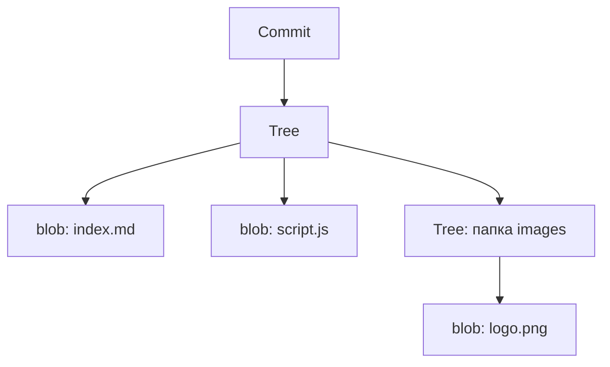

## 📘 Git

---

### 🔍 Что такое Git?

Git — это система контроля версий. Она помогает сохранять и отслеживать изменения в коде, работать над проектом в команде, а также возвращаться к любому состоянию проекта из прошлого.

#### Зачем нужен Git?

| Проблема                                | Git помогает                     |
| --------------------------------------- | -------------------------------- |
| Потеряли важный файл                    | Восстановить из истории          |
| Нужно отменить неудачные изменения      | Вернуться к предыдущей версии    |
| Несколько человек работают над проектом | Сливать изменения без конфликтов |
| Нужно быстро починить код на продакшене | Вернуться в стабильную ветку     |

---

### 🗂️ Основные термины

| Термин      | Объяснение                                                    |
| ----------- | ------------------------------------------------------------- |
| Репозиторий | Папка с вашим проектом, которую отслеживает Git               |
| Коммит      | Снимок состояния файлов в определённый момент времени         |
| Ветка       | Отдельная линия разработки                                    |
| Индекс      | Область подготовки файлов к коммиту (staging area)            |
| `.git`      | Скрытая папка, где Git хранит всю информацию о проекте        |
| HEAD        | Указатель на текущую ветку или коммит, с которым вы работаете |

---

### 🛠️ Установка Git

Установите Git с официального сайта: [git-scm.com](https://git-scm.com)

---

### 🔁 Базовый рабочий цикл



1. Изменяете файлы
2. Добавляете их в индекс командой `git add`
3. Сохраняете коммит: `git commit -m "Комментарий"`
4. Отправляете изменения на сервер: `git push`

#### 🧪 Пример

```bash
git init
git add .
git commit -m "Первый коммит"
git remote add origin https://github.com/yourname/project.git
git push -u origin master
```

---
### 🔁 Как работает `.gitignore`

Файл `.gitignore` указывает Git, какие файлы и папки **не нужно** отслеживать.

#### 💡 Примеры использования:

```gitignore
# Игнорировать временные файлы
*.log
*.tmp

# Игнорировать все файлы в папке
temp/

# Игнорировать только один конкретный файл
config/local.env

# Игнорировать всё в папке, кроме файла README.md
build/*
!build/README.md
```

#### ⚠️ Важно:

* `.gitignore` работает **только для неотслеживаемых файлов**.
* Если файл уже отслеживается Git (вы уже делали `git add`), его нужно удалить из индекса:

```bash
git rm --cached путь/к/файлу
```

#### 🧰 Полезные шаблоны `.gitignore`:

* [github.com/github/gitignore](https://github.com/github/gitignore) — готовые `.gitignore` для разных языков и IDE

---

### 🚀 Как работает `git push`

Когда вы завершили работу над изменениями, закоммитили их и готовы отправить на сервер (например, GitHub), вы используете:

```bash
git push
```

Однако при первой отправке новой ветки нужно указать направление:

```bash
git push --set-upstream origin my-branch
```

или коротко:

```bash
git push -u origin my-branch
```

#### 🔍 Разберём по частям:

* `git push` — команда отправки коммитов из локальной ветки в удалённый репозиторий
* `origin` — имя удалённого репозитория (по умолчанию так называют GitHub/Bitbucket/GitLab)
* `my-branch` — имя локальной ветки
* `--set-upstream` (или `-u`) — устанавливает связь между локальной и удалённой веткой, чтобы в будущем можно было писать просто `git push` / `git pull`

#### 📌 Примеры:

```bash
git push -u origin main
# или
git push -u origin feature/auth
```

Без `-u`, придётся указывать имя ветки каждый раз:

```bash
git push origin main
```

После установки upstream можно просто писать:

```bash
git push
git pull
```

---

### 🌿 Ветвление и работа в команде



#### Основные команды ветвления:

```bash
git branch                  # показать список веток
git branch new-feature      # создать новую ветку
git checkout new-feature    # перейти в ветку (устаревший способ)
git switch new-feature      # перейти в ветку (новый способ)
git merge new-feature       # слить ветку new-feature в текущую
```

#### ⭮️ Как работает `git merge`

Когда вы используете `git merge имя-ветки`, Git берёт все изменения из указанной ветки и пытается объединить их с текущей.

##### Пример:

```bash
git switch main
git merge new-feature
```

Если ветки расходились, Git создаёт **merge-коммит** — специальный коммит, который объединяет историю двух веток.

##### Полезные параметры:

* `--no-ff` — принудительно создать merge-коммит, даже если возможно fast-forward (для сохранения истории)
* `--ff-only` — слить только если возможно fast-forward (без merge-коммита), иначе отменить merge
* `--squash` — объединить все коммиты из ветки в один коммит (удобно для чистой истории)

---

### 💥 Слияния и конфликты

Конфликт возникает, если Git не может автоматически объединить изменения, потому что две ветки изменили одну и ту же строку кода или структуру файла.

В таких случаях Git вставляет в код специальные метки:

```plaintext
<<<<<<< HEAD
Твой код (из текущей ветки)
=======
Чужой код (из сливаемой ветки)
>>>>>>> имя-ветки
```

* `<<<<<<<` — начало конфликтного блока, показывает ваш текущий код (из ветки `HEAD`)
* `=======` — разделяет два варианта кода
* `>>>>>>>` — завершает блок и указывает, из какой ветки поступил второй вариант

#### 💡 Как решить конфликт:

1. Откройте файл, где возник конфликт. Git покажет конфликтный блок, как выше.
2. Оставьте нужную версию кода (вашу, чужую или объедините вручную).
3. Удалите все метки `<<<<<<<`, `=======`, `>>>>>>>`.
4. Сохраните файл.
5. Отметьте файл как решённый:

   ```bash
   git add путь/к/файлу
   ```
6. Завершите слияние:

   * если это `merge`, выполните:

     ```bash
     git commit
     ```
   * если это `rebase`, выполните:

     ```bash
     git rebase --continue
     ```

Теперь Git продолжит процесс слияния или ребейза.

---

### 🕰 История и откаты

#### 🔎 Просмотр истории и различий

```bash
git log                 # Показать список коммитов
git log --oneline       # Краткая версия истории
git diff                # Показать отличия между рабочими файлами и последним коммитом
git diff <commit1> <commit2>  # Сравнить два коммита
```

#### 🧪 Проверка и откат к предыдущим состояниям

```bash
git checkout <commit-id>       # Перейти к определённому коммиту (detached HEAD)
git checkout main              # Вернуться обратно в основную ветку
```

```bash
git restore file.txt           # Восстановить файл из последнего коммита
git restore --staged file.txt  # Убрать файл из индекса (после add)
```

```bash
git reset HEAD~1               # Удалить последний коммит, сохранить изменения в файлах
git reset --hard <commit-id>   # Полный откат до коммита (удаляет изменения — осторожно!)
```

```bash
git revert <commit-id>         # Создаёт новый коммит, отменяющий изменения указанного коммита
```

#### 💡 Полезно знать

* `reset` меняет историю (используйте с осторожностью)
* `revert` безопасен: он не удаляет, а добавляет "отменяющий" коммит
* `restore` удобен для возврата отдельных файлов без изменений истории

---

### 📦 Git Stash — временное сохранение изменений

Если вы хотите временно отложить текущие изменения (например, чтобы переключиться на другую ветку), используйте `git stash`.

```bash
git stash               # Сохраняет все незакоммиченные изменения
```

Затем можно восстановить их:

```bash
git stash pop           # Восстановить и удалить из списка
# или
git stash apply         # Восстановить, но оставить в списке
```

Полезно посмотреть список отложенных изменений:

```bash
git stash list
```

Удалить конкретный stash:

```bash
git stash drop stash@{0}
```

---

### 🔃 Git Rebase — чистая история коммитов

`git rebase` позволяет "переписать" историю коммитов, делая её линейной и более понятной.

#### Пример:

```bash
git switch feature
```

```bash
git rebase main
```

Это применит коммиты из ветки `feature` поверх ветки `main`, как будто они были сделаны позже.

#### Отличие от merge:

* `merge` сохраняет историю ветвлений (создаёт merge-коммит)
* `rebase` делает историю линейной, без дополнительных узлов

#### Если возник конфликт при rebase:

1. Разрешите конфликт (как в разделе про merge)
2. Выполните:

```bash
git add путь/к/файлу
git rebase --continue
```

Отменить ребейз:

```bash
git rebase --abort
```

---

### 📋 Полный список основных команд

```bash
git init                         # создать репозиторий
git status                       # показать текущий статус
git add .                        # добавить все файлы
git commit -m "сообщение"        # зафиксировать изменения
git log --oneline                # краткий журнал
git diff                         # показать изменения
git branch                       # список веток
git checkout -b новая_ветка      # создать и перейти в ветку
git merge ветка                  # слить ветку
git pull                         # получить изменения с сервера
git push                         # отправить изменения на сервер
git stash                        # временно отложить изменения
git rebase ветка                 # переписать историю
```

---

### 🔁 Сравнение GitHub, GitLab и Bitbucket

| Характеристика    | GitHub         | GitLab        | Bitbucket               |
| ----------------- | -------------- | ------------- | ----------------------- |
| Владелец          | Microsoft      | GitLab Inc.   | Atlassian               |
| CI/CD             | GitHub Actions | Встроенный CI | Bitbucket Pipelines     |
| Публичные проекты | Да             | Да            | Да                      |
| Приватные проекты | Да (∞)         | Да (∞)        | Да (до 5 пользователей) |
| Wiki и Issues     | Да             | Да            | Да                      |
| Поддержка SSH     | Да             | Да            | Да                      |

---

### 💻 Визуализация истории в редакторах

**VS Code:**

* Установите расширение Git Graph или GitLens
* Откройте `View → Git Graph` или вкладку Source Control

**IntelliJ IDEA:**

* Перейдите `VCS → Git → Show Git Log`
* Используйте панель коммитов

---

### 📈 Структура объектов в Git

Git — это не просто копирование файлов. Это граф объектов, где каждый коммит указывает на "снимок" дерева файлов.

#### 🔹 Типы объектов:

| Объект | Что содержит                 |
| ------ | ---------------------------- |
| blob   | Содержимое файла (без имени) |
| tree   | Папка: список файлов/папок   |
| commit | Ссылка на дерево + метаинфо  |



Если файл не менялся — Git повторно использует blob. Изменился один файл — хранится только он, а не весь проект заново. Всё это в `.git/objects`.

---

### 📌 Полезные ссылки

* [Официальная документация Git (на русском)](https://git-scm.com/book/ru/v2)
* [Интерактивное обучение Git (learngitbranching)](https://learngitbranching.js.org/)
* [Git Handbook от GitHub](https://docs.github.com/en/get-started/using-git/about-git)
* [Визуализация коммитов](https://git-school.github.io/visualizing-git/)
* [Git для начинающих на Хабре](https://habr.com/ru/articles/541258/)
* [Перевод статьи "Git для профессионалов"](https://habr.com/ru/articles/273897/)
* [Сравнение merge и rebase на русском](https://www.atlassian.com/ru/git/tutorials/merging-vs-rebasing)

---

### ✅ Заключение

Git — это как машина времени для вашего кода. Он позволяет:

* Не бояться ошибок
* Работать вместе с другими
* Экспериментировать безопасно
